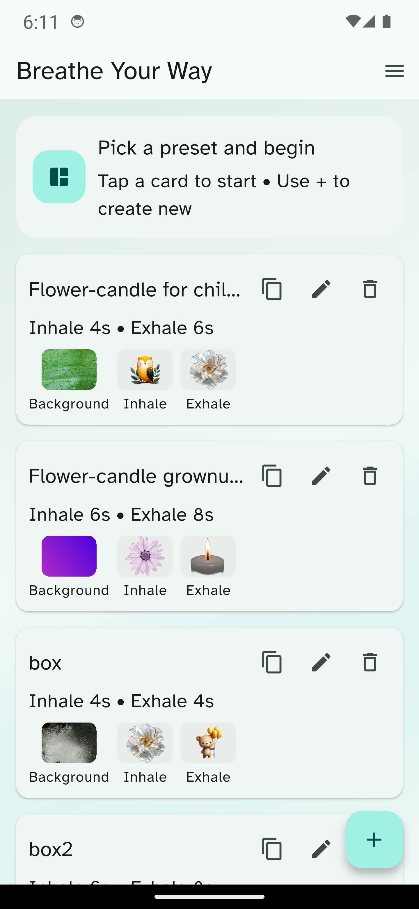
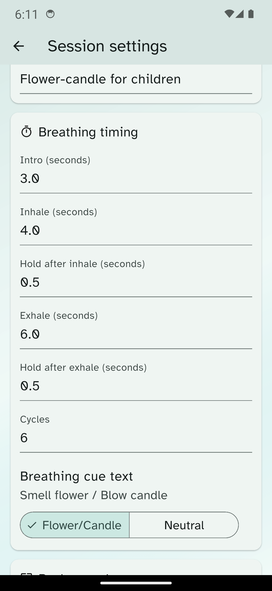
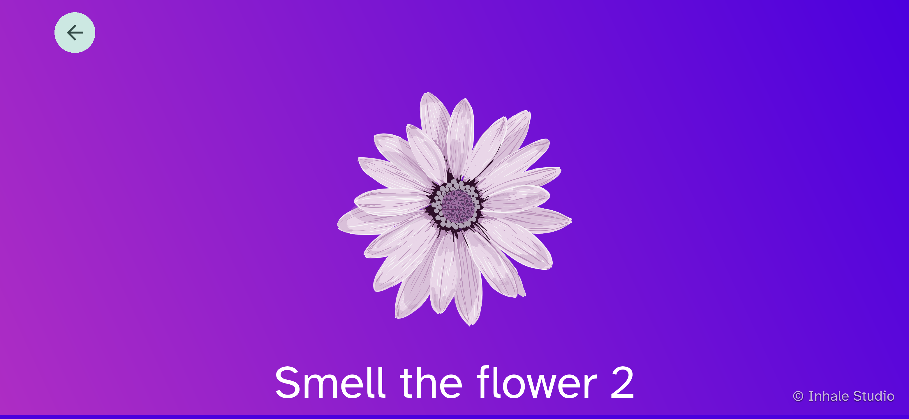

# Inhale Studio Help

Inhale Studio helps you create and run guided breathing sessions with your own pacing, visuals, and music.

## What you can do

- Create multiple breathing videos
- Edit timing, visuals, colors, and music for each video
- Duplicate or delete videos
- Switch the app language between English and Hebrew
- Share the video parameters (using built in assets only)

## Home screen

The home screen shows your saved videos.

For each video you can:

- **Tap the card** to start the session
- **Edit** the video
- **Duplicate** the video
- **Delete** the video
- **Share** the parameters

Use the **+** button to create a new video.

<!-- SCREENSHOT: Home screen actions / menu -->

## Menu

From the menu, you can open:

- **Language** — switch between English and Hebrew
- **About** — app info, contact, support, and licenses
- **Credits** — music and image creator credits

## Session settings

Each video can be customized by pressing the **Edit** button.

### Session

- **Session name**

### Breathing timing

- **Intro** duration
- **Inhale** duration
- **Hold after inhale** duration
- **Exhale** duration
- **Hold after exhale** duration
- **Number of cycles**

Current limits:

- Inhale, exhale, and hold durations: up to **120 seconds**
- Cycles: up to **60**

If a value is invalid, the page shows an error and scrolls to the relevant field when you press **Save and Start**.

### Breathing cue style

Choose how the breathing instructions are shown:

- **Flower/Candle**: will show "smell the flower"/"blow out the candle"
- **Neutral**: Whill show "Inhale" and "Exhale"

### Background

You can use:

- A gradient background color pair
- A background image from the built-in library
- Your own uploaded background image

Background images can be displayed in:

- **Fit** mode - preserve original aspect ratio, centered
- **Stretch** mode - stretches to fill the background

<!-- SCREENSHOT: Session settings - background section -->

### Breathing visuals

You can choose separate inhale and exhale images.

Options include:

- Built-in image library
- Your own uploaded PNG or GIF files

### Music

You can add optional background music using:

- The built-in music library
- Your own audio file

Supported uploaded formats:

- MP3
- WAV
- M4A
- AAC
- OGG

You can also adjust the playback volume.

<!-- SCREENSHOT: Session settings - visuals and music -->

## Running a session

When a session starts, the app shows:

- An intro message
- The breathing animation
- Cue text for inhale, exhale, and hold
- A countdown timer
- A progress bar for session progress

You can stop the session at any time using the back button.

## Language switching

The app supports:

- **English**
- **Hebrew**

Use the **Language** option in the menu to switch instantly. Your choice is remembered for the next time you open the app.

## About and Credits

### About

The About page includes:

- App version
- Contact link
- Support link
- Open-source license information

### Credits

The Credits page lists included music and image creators. Where available, each creator has a link to their Pixabay creator page.

<!-- SCREENSHOT: Credits page -->

## Tips

- Create a few videos for different situations, such as calming down, focusing, or bedtime.
- Use shorter sessions for children or quick reset breaks.
- Use neutral cues if you prefer simpler breathing language.
- Add your own images and music to create a more personal experience.

## Troubleshooting

- If **Save and Start** does not continue, check the highlighted field and scroll target for validation errors.
- If an image preview is unavailable, the file may be missing or unsupported.
- If music does not load, confirm the file format is supported.
- If a creator link does not open, try again later or open it in a browser manually.

## Need more help?

[Contact me](/contact).
